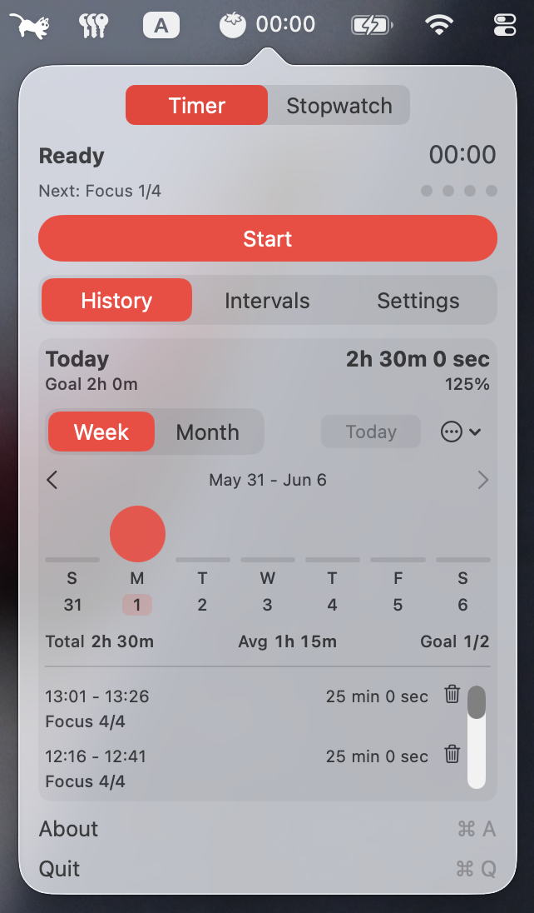

<p align="center">

<p>
 
<h1 align="center">TomatoBar</h1>
<p align="center">
 
</p>



## Overview
Have you ever heard of Pomodoro? It’s a great technique to help you keep track of time and stay on task during your studies or work. Read more about it on <a href="https://en.wikipedia.org/wiki/Pomodoro_Technique">Wikipedia</a>.

TomatoBar is world's neatest Pomodoro timer for the macOS menu bar. All the essential features are here - configurable
work and rest intervals, optional sounds, discreet actionable notifications, global hotkey.

Signed builds use the macOS app sandbox.

Download the latest release <a href="https://github.com/jsoone24/TomatoBar/releases/latest/">here</a>.

The upstream app can also be installed using Homebrew:
```
$ brew install --cask tomatobar
```

If the app doesn't start, install using the `--no-quarantine` flag:
```
$ brew install --cask --no-quarantine tomatobar
```

## Updates in this fork
This fork keeps the menu bar Pomodoro workflow and adds focus-history tracking, a stopwatch mode, configurable repeated work sets, and updated localized UI strings.

Recent maintenance changes:
- Removed the WidgetKit extension and stale widget project wiring.
- Kept reusable focus statistics formatting in the main app.
- Fixed set rollover after a long break so the next set starts from focus interval 1 and does not keep scheduling long breaks.

## Building a local app
Build a Release `.app` with:
```
$ xcodebuild -project TomatoBar.xcodeproj -scheme TomatoBar -configuration Release build
```

The app is written to Xcode DerivedData, usually:
```
~/Library/Developer/Xcode/DerivedData/TomatoBar-*/Build/Products/Release/TomatoBar.app
```

You can then copy `TomatoBar.app` to `/Applications`.

## Local data
Focus history is stored as newline-delimited JSON in `FocusSessions.jsonl`.

For signed sandboxed builds with this fork's bundle identifier, the file is stored at:
```
~/Library/Containers/com.jsoone24.TomatoBar/Data/Library/Application Support/TomatoBar/FocusSessions.jsonl
```

Unsigned or ad-hoc local builds may run outside the sandbox and use:
```
~/Library/Application Support/TomatoBar/FocusSessions.jsonl
```

If history appears to disappear after switching between signed and unsigned builds, check both locations before deleting anything. The data is usually still present in the other storage location.

## Integration with other tools
### Event log
TomatoBar logs state transitions in JSON format to `TomatoBar.log` under the app's cache directory. For signed sandboxed builds in this fork, that is usually `~/Library/Containers/com.jsoone24.TomatoBar/Data/Library/Caches/TomatoBar.log`. Use this data to analyze your productivity and enrich other data sources.
### Starting and stopping the timer
TomatoBar can be controlled using `tomatobar://` URLs. To start or stop the timer from the command line, use `open tomatobar://startStop`.

## Older versions
Touch bar integration and older macOS versions (earlier than Big Sur) are supported by TomatoBar versions prior to 3.0

## Licenses
 - Timer sounds are licensed from buddhabeats
